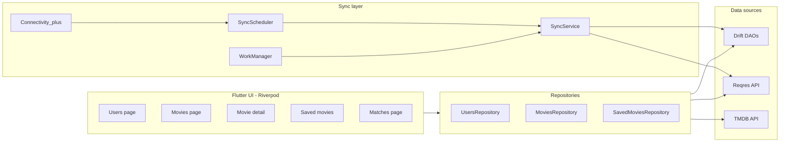

# cine_match

A movie discovery app where multiple users can each save movies they want to watch. The **Matches** page shows which movies more than one user has saved, making it easy for a group to agree on what to watch together.

Submission for the **Platform Commons Flutter Developer take-home assignment**.

📦 **[Download v1.0.0 APK](https://github.com/shreyas-badachi/cine_match/releases/download/v1.0.0/app-release.apk)** — install on any Android device (requires "Install from unknown sources" enabled). 58.8 MB. The app keys are baked in, so the reviewer can run it without setting up `.env`.

---

## What the app does

- **Users page** — paginated list from Reqres. Each user shows their avatar, name, and live save count.
- **Add User** — create a user (Name + Movie Taste). Works offline; syncs automatically when connectivity returns.
- **Movies** — paginated trending list from TMDB. Each card has a live save-count badge and a per-user save toggle. Hero animation on poster → detail page.
- **Movie Detail** — large poster, overview, formatted release date, save toggle, and "N users want to watch this" with mini avatars.
- **Saved Movies** — per-user list, fully offline. Header shows the user's avatar, name, and movie taste.
- **Matches** — movies saved by 2+ users, sorted by save count. Movies saved by **every** user are highlighted as the **TOP PICK**. Live — updates in real time as users save/unsave.
- **Reconnecting bar** — small floating chip at the bottom while the retry interceptor is re-issuing a failed request. Never blocks.

All pages work offline. New users / saves persist locally and reconcile to the server automatically once the network returns. No data lost. No duplicate users or saves.

---

## Setup

### Prerequisites

- Flutter SDK (Dart `^3.11.0`)

### API keys

This app uses three external APIs. Get keys from their websites and put them in a local `.env` file (see `.env.example`):

| Service | Key | Purpose |
|---|---|---|
| **TMDB** | `TMDB_BEARER_TOKEN` | Movie data (primary). Get a v4 Read Access Token at [themoviedb.org → Settings → API](https://www.themoviedb.org/settings/api) |
| **Reqres** | `REQRES_API_KEY` | User data. Sign up at [reqres.in](https://reqres.in) for the free key |
| **OMDB** | `OMDB_API_KEY` | Optional backup if TMDB is unavailable. [omdbapi.com](https://www.omdbapi.com/apikey.aspx) |

### Run

```bash
cp .env.example .env       # then paste your keys into .env
flutter pub get
dart run build_runner build  # generates Drift code (already committed, but run if regenerating)
flutter run
```

`.env` is gitignored — keys never enter source control.

> **Security note:** any key bundled into the APK is extractable. For a production app these would be proxied through a backend. Acceptable trade-off for an assignment.

### Run tests

```bash
flutter test
```

23 tests covering the load-bearing logic — DB schema invariants, retry interceptor, sync flow, FK-safe save, and the Add User form. See [Testing](#testing) below.

---

## How the code is structured

**Feature-first Clean Architecture** — adding a new feature is a single new directory under `lib/features/`, not a sweep across the codebase.

```
lib/
├── core/                          # cross-cutting infrastructure
│   ├── database/                  # Drift schema, DAOs, AppDatabase
│   │   ├── tables/                #   one file per table
│   │   ├── daos/                  #   one file per DAO
│   │   └── app_database.dart
│   ├── network/                   # Dio clients + retry interceptor
│   ├── sync/                      # SyncService, SyncScheduler, WorkManager callback
│   ├── theme/                     # Material 3 dark theme + design tokens
│   └── widgets/                   # cross-feature widgets (reconnecting banner)
├── features/
│   ├── users/                     # data/ domain/ presentation/
│   ├── movies/
│   ├── matches/
│   └── saved_movies/
├── routes/                        # go_router config
└── main.dart
```

Each feature follows `data/` (datasources + repositories + models) → `presentation/` (pages + widgets + providers).

**Key dependency rule:** `features/` may depend on `core/`. `core/` never depends on `features/`. Cross-feature dependencies go through repositories or providers, never widget-to-widget.

---

## Architecture at a glance



---

## Design system

**Material 3 dark theme** with a custom design-token layer.

- **Seed color:** warm crimson `#B91C1C`. `ColorScheme.fromSeed` generates a coherent tonal palette from this single color — primary, secondary, surface, and their `on*` counterparts are all guaranteed to have accessible contrast.
- **Accent (amber `#FFB020`):** intentionally outside the M3 palette — used for save-count badges and the "TOP PICK" border so they visually break from the generated harmony.
- **Surface override:** scaffold sits on `#0E0E10` (slightly deeper than the M3 default surface) for a "dark theatre" feel that lets posters carry visual weight.
- **Typography:** Google Fonts Inter applied over M3's type scale.
- **Tokens:** spacing (4/8/12/16/24/32/48), radius (8/12/16/24/pill), and animation durations (fast/normal/slow) are defined once in `lib/core/theme/app_dimensions.dart` and referenced everywhere — no magic numbers in widgets.
- **Component themes:** `AppBarTheme`, `CardThemeData`, `FilledButtonThemeData`, `InputDecorationTheme`, `SnackBarThemeData` are set centrally so every component already looks right without per-widget styling.

---

## Database schema

Three tables — see `lib/core/database/tables/`.

```
users                          movies                       saved_movies
─────                          ──────                       ────────────
id            (PK, autoinc)    id        (PK, TMDB id)      user_id    (FK → users.id, CASCADE)
server_id     (UNIQUE, NULL)   title                        movie_id   (FK → movies.id, CASCADE)
first_name                     overview                     saved_at
last_name                      poster_path                  PRIMARY KEY (user_id, movie_id)
email                          release_date
avatar_url                     cached_at
movie_taste
pending_sync
created_at
```

### The user → saved_movies relationship — three load-bearing decisions

**1. `users.id` is a stable autoincrement local PK; `server_id` is nullable, filled later.**

The naive design — using the Reqres-assigned ID as the primary key — falls apart for offline-created users. When sync completes and the server hands back a real ID, every `saved_movies` reference would need to migrate. With a stable local PK, sync is a single-column UPDATE on `users.server_id`. **`saved_movies` rows never need to change** when a user goes from offline-created to synced.

`server_id` carries a UNIQUE constraint so re-running a failed sync can't duplicate. SQLite's UNIQUE allows multiple NULLs, so unsynced users coexist freely.

**2. `saved_movies` uses a composite primary key `(user_id, movie_id)`.**

The spec says "no duplicate saves." Most candidates enforce this in app code with check-then-insert. That's race-prone. With the composite PK, duplicates are *physically impossible*. The DAO uses `INSERT OR IGNORE` so repeat saves are silent no-ops — the UI never has to think about it.

**3. Foreign keys with `ON DELETE CASCADE`** + `PRAGMA foreign_keys = ON` in `MigrationStrategy.beforeOpen`.

SQLite ignores FK constraints by default. Without the PRAGMA, cascades silently do nothing. Verified by a test (`test/core/database/app_database_test.dart` — "deleting a user removes their saved_movies").

---

## Offline & sync strategy

### The rule: local-first, sync-best-effort

Every write goes to the local DB synchronously. The network attempt is fire-and-forget. The user never waits.

```
UsersRepository.createUser(...)
  ├── INSERT into local DB with pending_sync = true
  ├── if online: unawaited POST to Reqres → markSynced(localId, serverId)
  ├── if offline: schedule WorkManager one-off task with NetworkType.connected
  └── return localId   ← UI updates instantly via DB Stream
```

### Two sync triggers — belt-and-braces

- **`SyncScheduler`** (foreground) — listens to `connectivity_plus` and triggers `SyncService.syncPendingUsers()` on offline → online transitions. Runs while the app is open.
- **`WorkManager`** — registered with a `NetworkType.connected` constraint when an offline user is created. Runs at the OS level; covers the case where the app was killed before connectivity returned.

Both are guarded against duplication:
1. `users.server_id` UNIQUE constraint
2. `getPendingSync()` only returns rows still flagged `pending_sync = true`
3. `SyncScheduler._syncInFlight` boolean prevents re-entry from rapid connectivity events

### What survives the offline test

The spec's airplane-mode scenario:

> Add a new user → open their saved-movies page (empty but visible) → go to Movies (already loaded) → save a few movies → turn internet back on.

Walk-through:

1. `createUser` writes the user with `pending_sync = true`. UI updates instantly.
2. Saved Movies page reads from `savedMoviesDao.watchSavedFor(userId)` — pure DB query, no network.
3. Movies page renders from in-memory pagination state populated *before* airplane mode; saves go through `SavedMoviesRepository.save` which writes to local DB only.
4. Reconnect → `SyncScheduler` fires → `SyncService.syncPendingUsers()` POSTs the user → `markSynced(localId, serverId)`.
5. **`saved_movies` rows referenced the local PK all along — they don't need to be touched.** Saved movies are still correctly linked.

### iOS reality check

WorkManager is reliable on Android. On iOS, Apple restricts background execution heavily — periodic background fetches are best-effort. The `SyncScheduler` (foreground listener) covers most real-world iOS sync needs. Documented honestly rather than over-promised.

---

## Bad-connection handling

For the spec's "30% of network calls randomly blocked" test:

- **`RetryInterceptor`** on every Dio client — exponential backoff (400ms → 800ms → 1.6s, max 3 retries).
- **Retryable**: connection errors, timeouts, 5xx. **Not retryable**: 4xx (permanent client error), `cancel`, `badCertificate`.
- **`onRetryStart` / `onRetryEnd` callbacks** drive `NetworkStatusNotifier`. The `ReconnectingBanner` widget watches this state and shows a small floating "Reconnecting…" chip at the bottom while a retry is in flight. Non-blocking — the spec calls this out: "not a blocking pop-up."
- Tests: `test/core/network/retry_interceptor_test.dart` covers all four retry-contract paths.

---

## Live data — how the Matches page updates in real time

The Matches page reads from `savedMoviesDao.watchMatches()`:

```sql
SELECT m.id, m.title, m.poster_path, m.release_date,
       COUNT(s.user_id) AS save_count,
       GROUP_CONCAT(s.user_id) AS user_ids
FROM saved_movies s
INNER JOIN movies m ON m.id = s.movie_id
GROUP BY s.movie_id
HAVING COUNT(s.user_id) >= 2
ORDER BY save_count DESC, m.title ASC
```

This is a Drift `customSelect` declared with `readsFrom: {savedMovies, movies}`. That tells Drift's stream layer to re-emit whenever either table changes. So a single `save()` call writes one row → Drift sees the change → the Stream emits new data → every widget watching the Matches list rebuilds. **The database itself is the broadcast channel.** No event bus, no manual refresh logic.

The same mechanism powers the live save-count badge on every movie card (`watchSaveCount(movieId)`) and the Save button's icon (`watchIsSaved(userId, movieId)`).

---

## Testing

23 tests. The focus is on **load-bearing invariants** — schema correctness, sync flow, and behavior most candidates get wrong.

```
test/
├── core/
│   ├── database/
│   │   └── app_database_test.dart       # 5 tests — schema invariants
│   ├── network/
│   │   └── retry_interceptor_test.dart  # 4 tests — retry contract
│   └── sync/
│       └── sync_service_test.dart       # 5 tests — offline sync
├── features/
│   ├── saved_movies/
│   │   └── saved_movies_repository_test.dart  # 4 tests — FK-safe save
│   └── users/
│       └── add_user_page_test.dart      # 4 tests — form behavior
└── widget_test.dart                     # 1 test — app boot smoke test
```

The DB and sync tests use an in-memory `NativeDatabase.memory()` so they're fast and isolated.

---

## Decisions worth flagging (not obvious from the code)

- **TMDB v4 Bearer token** instead of the `?api_key=` query param shown in the assignment. Keys-in-URL leak through logs and screenshots; Bearer header keeps them out. Same endpoints, stronger security.
- **Riverpod doubles as DI** — no `get_it`. Provider compile-safety > runtime "provider not found" errors.
- **Drift instead of `sqflite`** — `Stream` results from queries make live-updating UI ergonomic. The Matches page being live is essentially free.
- **Two state sources on the Movies page** — pagination state (in-memory list) preserves TMDB's "trending today" order; the DB cache exists separately so Saved Movies / Movie Detail work offline. They're deliberately not the same source.
- **`@DataClassName('Movie')` annotation** — Drift's auto-singularization pluralized `Movies` to `Movy`. Worth knowing as a gotcha.
- **`PRAGMA foreign_keys = ON`** in `beforeOpen` — SQLite ignores FK constraints by default. Without this, the `ON DELETE CASCADE` is silently disabled.
- **`*.g.dart` is committed** — so reviewers can run the APK without first running `build_runner`.
- **The widget test explicitly unmounts at the end** — Drift's `StreamQueryStore.markAsClosed` schedules a zero-duration cleanup `Timer` during disposal. Without an explicit unmount, the test framework's invariant check sees the timer as leaking. One-line fix; non-obvious diagnosis.

---

## Known limitations

- **iOS background sync** — Apple-restricted, best-effort. Foreground sync via `SyncScheduler` covers most real-world cases.
- **Offline-created user duplication risk** — if a Reqres POST succeeds but the response is lost in transit, the local row stays `pending_sync = true` and the next sync re-POSTs it, creating a duplicate server-side. A real-world fix would be a client-generated UUID that the server dedupes on, but Reqres has no such endpoint. Documented as a known gap.
- **`google_fonts` runtime fetch** — Inter is fetched on first launch and cached. A first-time install needs internet *once* before fonts work. For production I'd bundle the .ttf in `assets/fonts/`.
- **No automated tests for live UI streams** — the DAO Stream queries are tested directly; the UI consuming them is not. Manual testing via airplane-mode + multi-user flow.

---

## AI usage disclosure

I used Claude Code (Anthropic's CLI) as a primary collaborator and ChatGPT as a secondary sounding board for early scaffolding decisions.

The full prompt log — every architectural decision, the alternatives considered, the trade-offs taken, and the bugs caught along the way — is in **[PROMPTS.md](./PROMPTS.md)**.

---

## License

Submission for Platform Commons engineering take-home. Not licensed for redistribution.
